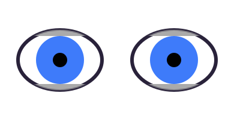

# Cartoon Eyes for React

A tiny, dependency-free React component for rendering customisable animated cartoon
eyes as inline SVG. Make them blink, wander randomly, follow the mouse cursor or look
towards any controlled position.



[](https://www.npmjs.com/package/cartoon-eyes)
[](https://bundlephobia.com/package/cartoon-eyes)
[](LICENSE)

### 👉 [Try the live playground](https://tmrk.github.io/cartoon-eyes/)

Design an eye visually — shape, colours, eyelids, pupils, blinking, movement — and copy
the matching React code.

## Installation

```bash
npm install cartoon-eyes
```

No runtime dependencies. Ships as ESM with TypeScript declarations included.

## Quick start

```jsx
import { Eye } from 'cartoon-eyes';

function App() {
  return (
    <Eye
      size={120}
      irisColor='#3E7BFA'
      scleraWidth={80}
      scleraHeight={55}
      irisSize={80}
      pupilSize={30}
      blinking
    />
  );
}

export default App;
```

## Use cases

- Animated website mascots and playful landing pages
- Eyes that follow the mouse (googly-eye / xeyes effects)
- Avatars, character creators and profile cards
- Children's and educational interfaces
- Games and interactive stories
- Loading states, empty states and Easter eggs
- Eyes attached to logos or illustrations

## How sizing works

All geometry props are **percentages relative to their parent shape**: the sclera is
sized against the drawing area, the iris against the sclera, and the pupil against the
iris. A circular iris or pupil is fitted against the smaller of its parent's radii, so
it always stays inside an elliptical parent.

The drawing area is square and the eye always keeps its proportions: equal
`scleraWidth` and `scleraHeight` render a perfect circle. If `width` and `height`
differ, the drawing is scaled to fit and centred rather than stretched.

## Props

| Prop | Type | Default | Description |
| --- | --- | --- | --- |
| `size` | number \| string | - | Sets both `width` and `height` of the SVG |
| `width`, `height` | number \| string | `size` | Rendered SVG dimensions |
| `scleraWidth` | number | `100` | Eye outline width, % of the drawing area |
| `scleraHeight` | number | `100` | Eye outline height, % of the drawing area |
| `scleraColor` | string | `'#ffffff'` | Sclera fill colour |
| `irisSize` | number | `60` | Iris width and height, % of the sclera |
| `irisWidth`, `irisHeight` | number | `irisSize` | Set iris dimensions separately |
| `irisColor` | string | `'#666666'` | Iris fill colour |
| `pupilSize` | number | `50` | Pupil width and height, % of the iris |
| `pupilWidth`, `pupilHeight` | number | `pupilSize` | Set pupil dimensions separately (e.g. `pupilWidth={14} pupilHeight={90}` for a cat's slit) |
| `pupilColor` | string | `'#000000'` | Pupil fill colour |
| `lidSize` | number | `20` | Both eyelid sizes, % of the sclera half-height |
| `upperLidSize`, `lowerLidSize` | number | `lidSize` | Set eyelid sizes separately |
| `lidColor` | string | `'#aaaaaa'` | Both eyelid colours |
| `upperLidColor`, `lowerLidColor` | string | `lidColor` | Set eyelid colours separately |
| `lensPosition` | `[x, y]` | `[0, 0]` | Where the eye looks; each axis −100 (left/top) to 100 (right/bottom) |
| `lensMovement` | boolean \| number | `false` | Wander randomly; a number sets the interval in ms (default 1000) |
| `lensSpeed` | number | `500` | Lens movement transition duration, ms |
| `blinking` | boolean \| number | `false` | Blink periodically; a number also sets `blinkSpeed` |
| `blinkSpeed` | number | `80` | How long a blink lasts, ms |
| `blinkFrequency` | number | `3000` | Time between blinks, ms |
| `blinkSqueeze` | boolean | `false` | Squash the whole eye vertically while blinking |
| `title` | string | - | Accessible name (rendered as an SVG `<title>`) |
| `className`, `style` | - | - | Passed through to the `<svg>` element |
| `scleraStyle`, `irisStyle`, `pupilStyle`, `upperLidStyle`, `lowerLidStyle` | object | `{}` | Inline styles for the individual shapes |

## Recipes

### A single blinking eye

```jsx
<Eye size={100} blinking />
```

### A pair of eyes

Render two eyes with the same props; their timers run independently, which looks
natural. Share the config in one object:

```jsx
const eye = {
  size: 90,
  scleraWidth: 70,
  scleraHeight: 50,
  irisColor: '#3E7BFA',
  irisSize: 80,
  pupilSize: 30,
  blinking: true,
};

<div style={{ display: 'flex', gap: 8 }}>
  <Eye {...eye} />
  <Eye {...eye} />
</div>
```

### Eyes that follow the mouse cursor

`lensPosition` is fully controlled, so map the pointer position to the −100..100 range
and both eyes will track it:

```jsx
import { useEffect, useState } from 'react';
import { Eye } from 'cartoon-eyes';

function FollowingEyes() {
  const [lens, setLens] = useState([0, 0]);

  useEffect(() => {
    const onMove = (e) => setLens([
      (e.clientX / window.innerWidth) * 200 - 100,
      (e.clientY / window.innerHeight) * 200 - 100,
    ]);
    window.addEventListener('mousemove', onMove);
    return () => window.removeEventListener('mousemove', onMove);
  }, []);

  return (
    <div style={{ display: 'flex', gap: 8 }}>
      <Eye size={90} lensPosition={lens} lensSpeed={120} blinking />
      <Eye size={90} lensPosition={lens} lensSpeed={120} blinking />
    </div>
  );
}
```

### Randomly wandering eyes

```jsx
<Eye size={100} lensMovement blinking />        {/* new position every second */}
<Eye size={100} lensMovement={2500} blinking /> {/* every 2.5 s */}
```

### Cat-style pupils

A tall, narrow pupil against a round amber iris:

```jsx
<Eye
  size={100}
  scleraWidth={72} scleraHeight={66} scleraColor='#f6edd2'
  irisSize={95} irisColor='#E8A33D'
  pupilWidth={14} pupilHeight={90} pupilColor='#1c1c1c'
  upperLidSize={12} lowerLidSize={8} lidColor='#8a6d3b'
  blinking blinkFrequency={5000}
/>
```

### Sleepy, half-closed eyes

A heavy upper lid does the trick:

```jsx
<Eye
  size={100}
  scleraWidth={75} scleraHeight={45} scleraColor='#fff5f0'
  irisSize={70} irisColor='#7a6ea8'
  upperLidSize={55} lowerLidSize={25} lidColor='#d9b8a6'
  lensPosition={[-20, 40]}
/>
```

### Responsive sizing

`size`, `width` and `height` accept any SVG-valid value, so percentages work; the eye
then follows its container:

```jsx
<div style={{ width: '30vw' }}>
  <Eye width='100%' height='100%' blinking />
</div>
```

### Accessibility

Give a meaningful eye an accessible name with `title`; hide purely decorative eyes
from screen readers by wrapping them:

```jsx
<Eye title='Mascot watching the cursor' lensPosition={lens} />

<span aria-hidden='true'>
  <Eye lensMovement blinking />
</span>
```

### Next.js

The component uses hooks and timers, so in the App Router import it from a client
component:

```jsx
'use client';

import { Eye } from 'cartoon-eyes';

export default function Mascot() {
  return <Eye size={100} lensMovement blinking />;
}
```

The initial render is deterministic (IDs come from React's `useId`), so server
rendering and hydration work as expected; animation starts on the client.

## Compatibility

- React 18 and later
- ESM only
- Modern evergreen browsers
- Server rendering (e.g. Next.js) works; animations start after hydration

## Changes in v2

- **Fixed:** dark `scleraColor` values no longer make the iris and lids fade out
  (the internal SVG mask was luminance-based on the sclera colour).
- **Fixed:** multiple eyes on one page no longer risk sharing SVG element IDs.
- **Fixed:** the `lensMovement` timer is cleaned up on unmount.
- **Fixed:** `blinkSqueeze` no longer double-applies its squash.
- **New:** `lensSpeed`, `title`, `className` and `style` props; TypeScript types.
- The package now ships as ESM and requires React ≥ 18.

## Repository layout

- **Root**: the playground app (React + Vite + MUI), deployed to GitHub Pages.
- **[`src/components/`](src/components)**: the `cartoon-eyes` npm package itself
  (its [README](src/components/README.md) is what npm shows).

## Development

```
npm install
npm start          # playground dev server on http://localhost:3000
npm run build      # production build of the playground
npm run deploy     # publish the playground to GitHub Pages

cd src/components
npm run build      # build the npm package (dist/)
```

## Licence

MIT
