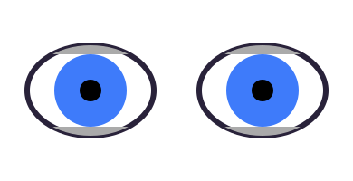

# Cartoon Eyes for React

A tiny, dependency-free React component for rendering customisable animated cartoon
eyes as inline SVG. Make them blink, wander randomly, follow the mouse cursor or look
towards any controlled position, one eye at a time or as a synchronised pair.



[](https://www.npmjs.com/package/cartoon-eyes)
[](https://github.com/tmrk/cartoon-eyes/actions/workflows/ci.yml)
[](https://bundlephobia.com/package/cartoon-eyes)
[](LICENSE)

### 👉 [Try the live playground](https://tmrk.github.io/cartoon-eyes/)

Design an eye visually — shape, colours, eyelids, pupils, blinking, movement — and copy
the matching React code.

## Installation

```bash
npm install cartoon-eyes
```

No runtime dependencies. Ships as ESM with TypeScript declarations included.

## Quick start

```jsx
import { Eye } from 'cartoon-eyes';

function App() {
  return (
    <Eye
      size={120}
      irisColor='#3E7BFA'
      scleraWidth={80}
      scleraHeight={55}
      irisSize={80}
      pupilSize={30}
      blinking
    />
  );
}

export default App;
```

Two eyes that look around and blink together are `EyePair`:

```jsx
import { EyePair } from 'cartoon-eyes';

<EyePair
  size={100}
  gap={20}
  eyeRotation={10}
  irisColor='#5AA'
  pupilSize={45}
  blinking
  lensMovement
/>
```

## Use cases

- Animated website mascots and playful landing pages
- Eyes that follow the mouse (googly-eye / xeyes effects)
- Avatars, character creators and profile cards
- Children's and educational interfaces
- Games and interactive stories
- Loading states, empty states and Easter eggs
- Eyes attached to logos or illustrations

## How sizing works

All geometry props are **percentages relative to their parent shape**: the sclera is
sized against the drawing area, the iris against the sclera, and the pupil against the
iris. A circular iris or pupil is fitted against the smaller of its parent's radii, so
it always stays inside an elliptical parent.

`limbusThickness` is a percentage of the iris radius, and the ring is taken *out of*
the iris rather than added around it: `limbusThickness={10}` colours the outer 10% of
the iris and shrinks the coloured centre to the remaining 90%. The iris keeps the size
`irisSize` gives it, so adding a limbus never grows the iris, resizes the pupil or
changes how far the eye can look. `eyeOutlineThickness` works the same way one level
up, taking the outer share of the sclera radii, so switching an outline on never pushes
the eye past the drawing area.

`catchlightSize` measures against the **full outer iris**, limbus included, and
`catchlightPosition` moves the glint through the slack left between it and that outer
edge - the same −100..100 scale `lensPosition` uses inside the sclera. Adding a limbus
therefore never resizes or shifts the catchlight.

Both eyelid sizes and both eyeliner sizes are percentages of the sclera half-height.
The eyeliner belongs to the lid margins rather than to the eye as a whole, so it rides
the lids up and down as they blink.

The drawing area is square and the eye always keeps its proportions: equal
`scleraWidth` and `scleraHeight` render a perfect circle. If `width` and `height`
differ, the drawing is scaled to fit and centred rather than stretched.

## Colours

Every colour prop takes any CSS colour the renderer understands, and may carry an
alpha channel as an 8-digit hex (`#RRGGBBAA`) or its 4-digit shorthand (`#RGBA`).
The alpha is split off into that shape's own `fill-opacity` rather than left in
the colour, so the drawing stays plain SVG:

```jsx
<Eye size={100} catchlightSize={26} catchlightColor='#FFFFFFCC' />
```

renders the glint as `<ellipse class='catchlight' fill='#FFFFFF' fill-opacity='0.8' ... />`.
A catchlight is the obvious place for it - a reflection rather than paint - but it
works for every colour prop, so a lid or a sclera can be translucent too.

## Props

| Prop | Type | Default | Description |
| --- | --- | --- | --- |
| `size` | number \| string | - | Sets both `width` and `height` of the SVG |
| `width`, `height` | number \| string | `size` | Rendered SVG dimensions |
| `scleraWidth` | number | `100` | Eye outline width, % of the drawing area |
| `scleraHeight` | number | `100` | Eye outline height, % of the drawing area |
| `scleraColor` | string | `'#ffffff'` | Sclera fill colour |
| `eyeOutlineThickness` | number | `0` | Outline around the eye, % of the sclera radius. Taken out of the sclera, like the limbus, and drawn over the eyelids. `0` renders no outline |
| `eyeOutlineColor` | string | `'#000000'` | Eye outline fill colour |
| `irisSize` | number | `60` | Iris width and height, % of the sclera |
| `irisWidth`, `irisHeight` | number | `irisSize` | Set iris dimensions separately |
| `irisColor` | string | `'#666666'` | Iris fill colour |
| `limbusThickness` | number | `0` | Limbus (the darker ring around the iris) thickness, % of the iris radius. `0` renders no ring |
| `limbusColor` | string | `'#000000'` | Limbus fill colour |
| `pupilSize` | number | `50` | Pupil width and height, % of the iris |
| `pupilWidth`, `pupilHeight` | number | `pupilSize` | Set pupil dimensions separately (e.g. `pupilWidth={14} pupilHeight={90}` for a cat's slit) |
| `pupilColor` | string | `'#000000'` | Pupil fill colour |
| `catchlightSize` | number | `0` | Catchlight width and height, % of the full outer iris (limbus included). `0` renders no catchlight |
| `catchlightWidth`, `catchlightHeight` | number | `catchlightSize` | Set catchlight dimensions separately |
| `catchlightPosition` | `[x, y]` | `[-40, -40]` | Where the glint sits inside the iris; each axis −100 (left/top) to 100 (right/bottom) |
| `catchlightColor` | string | `'#ffffff'` | Catchlight fill colour |
| `lidSize` | number | `20` | Both eyelid sizes, % of the sclera half-height |
| `upperLidSize`, `lowerLidSize` | number | `lidSize` | Set eyelid sizes separately |
| `lidColor` | string | `'#aaaaaa'` | Both eyelid colours |
| `upperLidColor`, `lowerLidColor` | string | `lidColor` | Set eyelid colours separately |
| `eyelinerSize` | number | `0` | Both eyeliner thicknesses, % of the sclera half-height. Drawn along the lid margins, so it moves with them. `0` renders no eyeliner |
| `upperEyelinerSize`, `lowerEyelinerSize` | number | `eyelinerSize` | Set eyeliner thicknesses separately |
| `eyelinerColor` | string | `'#000000'` | Both eyeliner colours |
| `upperEyelinerColor`, `lowerEyelinerColor` | string | `eyelinerColor` | Set eyeliner colours separately |
| `lensPosition` | `[x, y]` | `[0, 0]` | Where the eye looks; each axis −100 (left/top) to 100 (right/bottom) |
| `lensMovement` | boolean \| number | `false` | Wander randomly; a number sets the interval in ms (default 1000) |
| `lensSpeed` | number | `500` | Lens movement transition duration, ms |
| `rotation` | number | `0` | Tilt of the whole eye in degrees: negative rotates left, positive right. Not clamped to ±180, so it can be driven past a full turn |
| `rotationSpeed` | number | `0` | Rotation transition duration, ms (0 rotates immediately) |
| `blinking` | boolean \| number | `false` | Blink periodically; a number also sets `blinkSpeed` |
| `blinkSpeed` | number | `80` | How long a blink lasts, ms |
| `blinkFrequency` | number | `3000` | Time between blinks, ms |
| `blinkSqueeze` | boolean | `false` | Squash the whole eye vertically while blinking |
| `blinkClosed` | boolean | - | Controlled blinking: while it is set the eye's own blink timer stands down and the lids follow it, so a parent can blink several eyes in step |
| `title` | string | - | Accessible name (rendered as an SVG `<title>`) |
| `className`, `style` | - | - | Passed through to the `<svg>` element |
| `scleraStyle`, `eyeOutlineStyle`, `irisStyle`, `limbusStyle`, `pupilStyle`, `catchlightStyle`, `upperLidStyle`, `lowerLidStyle`, `upperEyelinerStyle`, `lowerEyelinerStyle` | object | `{}` | Inline styles for the individual shapes |

## `EyePair`

`EyePair` composes two `Eye`s rather than reimplementing one. Every `Eye` prop
given to it is shared by both eyes, and `leftEye` / `rightEye` override that
share one eye at a time:

```jsx
import { EyePair } from 'cartoon-eyes';

<EyePair
  size={120}
  gap={20}
  eyeRotation={10}
  scleraWidth={80} scleraHeight={60}
  irisColor='#3E7BFA'
  blinking
  lensMovement
  rightEye={{ irisColor: '#F2A03D' }}  // one odd eye
/>
```

It keeps the two eyes together where it matters:

- **One gaze.** `lensPosition` is *not* mirrored - if the pair looks right, both
  irises go right - and `lensMovement` wanders on a single timer, so the two eyes
  look the same way at the same time.
- **One blink.** The pair keeps one blink clock and drives both eyes from it, so
  the lids come down together instead of drifting apart.
- **Mirrored tilt.** `eyeRotation` is the outward splay: the left eye turns by
  `-eyeRotation`, the right one by `+eyeRotation`. A shared `rotation` turns both
  the same way, and the two add up.

An override that names a gaze prop (`lensPosition`, `lensMovement`) or a blink
prop (`blinking`, `blinkSpeed`, `blinkFrequency`, `blinkClosed`) takes that eye
off the shared clock, so one eye can wink, or look elsewhere, on its own.

| Prop | Type | Default | Description |
| --- | --- | --- | --- |
| `gap` | number | `20` | Space between the eyes as a % of one eye's nominal size, so the proportions hold at any size: `0` sets the two drawing areas side by side, `100` leaves a whole eye between them |
| `eyeRotation` | number | `0` | Mirrored tilt in degrees, positive turning the eyes outwards |
| `pairRotation` | number | `0` | Rotation of the whole pair as one unit, in degrees |
| `leftEye`, `rightEye` | `EyeProps` | - | Props for one eye, overriding the shared ones |
| `size`, `width`, `height` | number \| string | `100` | The nominal size of **one** eye, which `gap` is measured against |
| `title` | string | - | Accessible name for the pair |
| `className`, `style` | - | - | Passed to the wrapping element, not to the eyes |
| every other `Eye` prop | | | Shared by both eyes |

The eyes sit in an inline flex wrapper with the class `cartoon-eye-pair`, so a
pair flows like an image and can be placed with plain CSS.

## Recipes

### A single blinking eye

```jsx
<Eye size={100} blinking />
```

### A pair of eyes

```jsx
<EyePair size={90} gap={18} scleraWidth={70} scleraHeight={50}
  irisColor='#3E7BFA' irisSize={80} pupilSize={30} blinking lensMovement />
```

For a wink, take one eye off the shared blink and keep its lid down:

```jsx
<EyePair size={90} blinking rightEye={{ blinking: false, upperLidSize: 100 }} />
```

Two separate `Eye`s are still fine when you *want* their timers to drift apart:
render them side by side with the same props.

### Eyes that follow the mouse cursor

`lensPosition` is fully controlled, so map the pointer position to the −100..100 range
and the pair will track it - both eyes together, without mirroring:

```jsx
import { useEffect, useState } from 'react';
import { Eye } from 'cartoon-eyes';

function FollowingEyes() {
  const [lens, setLens] = useState([0, 0]);

  useEffect(() => {
    const onMove = (e) => setLens([
      (e.clientX / window.innerWidth) * 200 - 100,
      (e.clientY / window.innerHeight) * 200 - 100,
    ]);
    window.addEventListener('mousemove', onMove);
    return () => window.removeEventListener('mousemove', onMove);
  }, []);

  return <EyePair size={90} gap={20} lensPosition={lens} lensSpeed={120} blinking />;
}
```

### Randomly wandering eyes

```jsx
<Eye size={100} lensMovement blinking />        {/* new position every second */}
<Eye size={100} lensMovement={2500} blinking /> {/* every 2.5 s */}
```

### A tilted eye, and a spinning one

`rotation` turns the whole eye, lids and all, around the centre of the drawing area.
Negative angles tilt left, positive tilt right:

```jsx
<Eye size={100} scleraWidth={80} scleraHeight={55} rotation={-18} blinking />
```

Angles are not clamped to a single turn, so a counter that keeps climbing spins the
eye instead of snapping back at 180. Set `rotationSpeed` to ease between angles, or
leave it at 0 and drive every frame yourself:

```jsx
import { useEffect, useState } from 'react';
import { Eye } from 'cartoon-eyes';

function SpinningEye() {
  const [angle, setAngle] = useState(0);

  useEffect(() => {
    const id = setInterval(() => setAngle((a) => a + 6), 40); // never wraps
    return () => clearInterval(id);
  }, []);

  return <Eye size={120} scleraWidth={80} scleraHeight={55} rotation={angle} blinking />;
}
```

A pair looks livelier when the tilts mirror each other, which is what
`EyePair`'s `eyeRotation` does: `<EyePair eyeRotation={12} />` turns the left eye
to −12° and the right one to 12°.

### Cat-style pupils

A tall, narrow pupil against a round amber iris:

```jsx
<Eye
  size={100}
  scleraWidth={72} scleraHeight={66} scleraColor='#f6edd2'
  irisSize={95} irisColor='#E8A33D'
  pupilWidth={14} pupilHeight={90} pupilColor='#1c1c1c'
  upperLidSize={12} lowerLidSize={8} lidColor='#8a6d3b'
  blinking blinkFrequency={5000}
/>
```

### A limbus ring around the iris

`limbusThickness` paints the outer part of the iris in `limbusColor`, the way a real
eye has a darker rim. It is a share of the iris radius, so it scales with the iris and
follows an elliptical one on both axes:

```jsx
<Eye
  size={100}
  scleraWidth={72} scleraHeight={66} scleraColor='#f6edd2'
  irisSize={95} irisColor='#E8A33D'
  limbusThickness={9} limbusColor='#7a4a12'
  pupilWidth={14} pupilHeight={90}
  blinking
/>
```

The ring is a filled shape rather than a stroke, so it never spills outside the iris,
and `limbusThickness={0}` (the default) draws no ring at all.

### A catchlight, for the wet look

`catchlightSize` adds the glint of light every drawn eye has. It rides along with the
iris and pupil as the eye looks around, and it is painted over both, so it can sit
half on the pupil and half on the iris the way a real reflection does:

```jsx
<Eye
  size={100}
  scleraWidth={82} scleraHeight={82}
  irisSize={45} irisColor='#16A34A'
  pupilSize={55}
  catchlightSize={28} catchlightPosition={[-45, -45]}
  blinking
/>
```

`catchlightPosition` runs from −100 to 100 on each axis, measured against the full
outer iris, so `[-45, -45]` is the usual up-and-to-the-left highlight and `[0, 0]`
centres it on the pupil. Give it its own width and height for a drawn-out gleam:

```jsx
<Eye size={100} catchlightWidth={16} catchlightHeight={30} catchlightColor='#8FA8FF' />
```

### Eyeliner along the lid margins

`eyelinerSize` darkens the edge of each eyelid - the underside of the upper one, the
top of the lower one - so the line follows the lids as they blink instead of sitting
still around the eye:

```jsx
<Eye
  size={100}
  scleraWidth={72} scleraHeight={66} scleraColor='#f6edd2'
  irisSize={95} irisColor='#E8A33D'
  pupilWidth={14} pupilHeight={90}
  upperLidSize={12} lowerLidSize={8} lidColor='#8a6d3b'
  eyelinerSize={9} eyelinerColor='#3a2a12'
  blinking
/>
```

Each side can be set on its own, so a heavy top line over a hint of a bottom one is
`upperEyelinerSize={12} lowerEyelinerSize={4}`.

### An outline around the whole eye

`eyeOutlineThickness` inks a ring around the sclera. Like the limbus it is a filled
ring rather than a stroke, and it is taken out of the sclera rather than added around
it, so the eye keeps its size. It is drawn over the eyelids, so it frames the eye
however far the lids come down:

```jsx
<Eye
  size={100}
  scleraWidth={80} scleraHeight={80} scleraColor='#f7c948'
  eyeOutlineThickness={6} eyeOutlineColor='#3f6212'
  irisSize={70} irisColor='#b45309'
  pupilWidth={85} pupilHeight={30}
  lidSize={10} lidColor='#3f6212'
  blinking
/>
```

The thickness is a share of each sclera radius in turn, so an elliptical eye gets an
outline that follows its own shape rather than a circular one.

### Sleepy, half-closed eyes

A heavy upper lid does the trick:

```jsx
<Eye
  size={100}
  scleraWidth={75} scleraHeight={45} scleraColor='#fff5f0'
  irisSize={70} irisColor='#7a6ea8'
  upperLidSize={55} lowerLidSize={25} lidColor='#d9b8a6'
  lensPosition={[-20, 40]}
/>
```

### Responsive sizing

`size`, `width` and `height` accept any SVG-valid value, so percentages work; the eye
then follows its container:

```jsx
<div style={{ width: '30vw' }}>
  <Eye width='100%' height='100%' blinking />
</div>
```

### Accessibility

Give a meaningful eye an accessible name with `title`; hide purely decorative eyes
from screen readers by wrapping them:

```jsx
<Eye title='Mascot watching the cursor' lensPosition={lens} />

<span aria-hidden='true'>
  <Eye lensMovement blinking />
</span>
```

### Next.js

The component uses hooks and timers, so in the App Router import it from a client
component:

```jsx
'use client';

import { Eye } from 'cartoon-eyes';

export default function Mascot() {
  return <Eye size={100} lensMovement blinking />;
}
```

The initial render is deterministic (IDs come from React's `useId`), so server
rendering and hydration work as expected; animation starts on the client.

## Compatibility

- React 18 and later
- ESM only
- Modern evergreen browsers
- Server rendering (e.g. Next.js) works; animations start after hydration

## Changes in v2

- **Fixed:** dark `scleraColor` values no longer make the iris and lids fade out
  (the internal SVG mask was luminance-based on the sclera colour).
- **Fixed:** multiple eyes on one page no longer risk sharing SVG element IDs.
- **Fixed:** the `lensMovement` timer is cleaned up on unmount.
- **Fixed:** `blinkSqueeze` no longer double-applies its squash.
- **New:** `lensSpeed`, `title`, `className` and `style` props; TypeScript types.
- The package now ships as ESM and requires React ≥ 18.

### v2.1

- **New:** `rotation` and `rotationSpeed` props. Rotation is applied to the whole eye
  around the centre of the drawing area and accepts angles beyond ±180, so a spin can
  be animated without wrapping.

### v2.2

- **New:** `limbusThickness`, `limbusColor` and `limbusStyle` props, drawing the darker
  ring around the iris. The ring is taken out of the existing iris dimensions, so
  enabling it leaves the iris size, the pupil and the eye's movement untouched.

### v2.3

- **New:** `catchlightSize`, `catchlightWidth`, `catchlightHeight`,
  `catchlightPosition`, `catchlightColor` and `catchlightStyle`. The glint is measured
  and placed against the full outer iris, limbus and all, travels with the lens, and is
  drawn over both iris and pupil so it can cross the edge of either.
- **New:** `eyelinerSize`, `eyelinerColor`, `upperEyelinerSize`, `upperEyelinerColor`,
  `upperEyelinerStyle`, `lowerEyelinerSize`, `lowerEyelinerColor` and
  `lowerEyelinerStyle`, darkening the eyelid margins. The liner belongs to the lids, so
  it moves with every blink.
- **New:** `eyeOutlineThickness`, `eyeOutlineColor` and `eyeOutlineStyle`, inking a
  filled ring around the sclera over the top of the eyelids.
- All three default to `0` and render nothing until switched on.

### v2.4

- **New:** `EyePair`, which composes two `Eye`s and keeps them together: `gap`
  (a share of one eye's nominal size), `eyeRotation` (the mirrored outward tilt),
  `pairRotation`, and `leftEye` / `rightEye` overrides. The pair shares one gaze
  and one blink clock, so its eyes look the same way and blink at the same time,
  and an override takes one eye off either clock.
- **New:** `blinkClosed`, a controlled blink for `Eye`: while it is set the eye's
  own timer stands down and the lids follow the value. It is what `EyePair` uses
  to blink both eyes on one clock.
- **New:** every colour prop accepts an alpha channel as an 8-digit hex
  (`#RRGGBBAA`, or the `#RGBA` shorthand), split into `fill` and `fill-opacity`
  on the shape itself. A half-transparent glint is `catchlightColor='#FFFFFF80'`.
- `Eye` is otherwise unchanged: same props, same rendering.

## Repository layout

- **Root**: the playground app (React + Vite + MUI), deployed to GitHub Pages.
- **[`src/components/`](src/components)**: the `cartoon-eyes` npm package itself
  (its [README](src/components/README.md) is what npm shows).

## Development

```
npm install
npm start          # playground dev server on http://localhost:3000
npm run build      # production build of the playground
npm run deploy     # publish the playground to GitHub Pages

cd src/components
npm run build      # build the npm package (dist/)
```

## Licence

MIT
